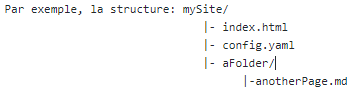
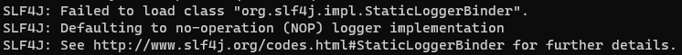
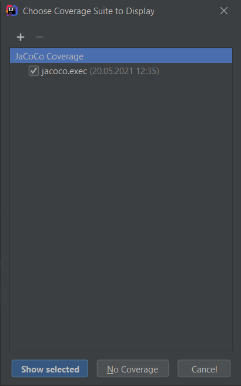
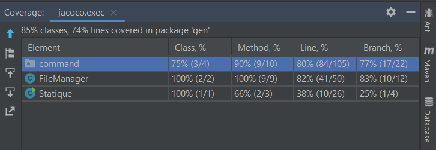

(nous somme le groupe qui n'a pas pu clonner le repo pour la documentation)
Vous la trouvez mise à jour dans la branche main "Rapport.docx".

# projet-berney_forestier_herzig
Ce projet est réalisé durant le cours génie logiciel de la HEIG-VD.
Il met à disposition un générateur de sites statiques.

## Auteurs
  * Berney Alec
  * Forestier Quentin
  * Herzig Melvyn
  
# Installation et utilisation

### 1) Télécharger l'archive
[récupérer l'archive statique.zip](https://github.com/gen-classroom/projet-berney_forestier_herzig/releases)

### 2) Dezippage de l'archive
**MacOS/Linux:**

```
unzip -o statique.zip
```

**Windows:**
dézipper l'archive *target/statique.zip* manuellement.

### 3) Ajouter l'application au path
 depuis l'intérieur de l'archive dézippée 
 
**MacOS/Linux:**  
```
export PATH=$PATH:`pwd`/bin
```

**Windows:**
Dans cmd.exe
```  
SET PATH=%PATH%;%cd%\bin
```

### 4) Exécution  
> Sous windows penser à utiliser cmd.exe

Executer <i>$statique</i> donne le résultat suivant
```
statique [-version] [COMMAND]
Usage: statique [COMMAND]
A static site generator.
      -version Print software version
Commands:
	new    Initialize a static site directory
	clean  Clean a static site
	build  Build a static site
	serve  Open the site in a web browser
```

les 4 commandes prennent des chemins de dossier. Si le chemin est manquand, la commande travail dans le répertoire
courant. 

<b>Scénario</b>

Si vous travaillez dans le répertoire <i>C:\user</i> et que vous souhaitez créer votre site dans le répertoire <i>C:\user\mySite</i>
>$ statique init /mySite

Pour lancer la création du site site
>$ statique init /mySite
Le résultat de la traduction est déployé dans <i>C:\user\mySite\build</i>

Vous voulez retirer le déploiement ?
>$ statique clean /mySite

La commande recherche un dossier nommé build et le supprime. Ne vous trompez en pointant sur un mauvais dossier

Pour visualiser votre site dans un navigateur.
>$ statique serve /mySite

#### Configuration
Dans le fichier config.yaml il est possible de définir le titre de votre site. Ce titre
apparaîtra dans l'onglet des navigateurs avec le titre de page.
```
---
site_titre: Mysite
---
```

#### Créer un page
Pour créer une page, copier coller le template suivant dans chaque fichier markdown.
```
---
page_titre: your page title here
---

# this is a title

whith content under it.
```
> page_titre est la seule metadonnée des pages.

Le contenu peut être ajouté en suivant la spécification commonmark:
https://commonmark.org/help/

#### Ajouter des liens dans le menu
Il est possible de créer un menu en éditant le fichier <i>/template/menu.html</i>

Pour chaque nouveau lien que vous souhaitez créer ajouter entre les balises <i>ul</i> présentes:
```
<li><a href="chemin/vers_un_fichier_md/depuis_le_dossier_init/index.html">nom du lien</a></li>
````
> Le fichier ciblé par le lien est insérer entre dans href="<fichier ici>". Le fichier doit être ciblé depuis 
> le dossier créer par init et en remplacant l'extension md par html.


			      	    
Si vous souhaitez créer un lien vers anotherPage.md, il faut écrire "aFolder/anotherPage.html" dans la balise href.

#### Problèmes connus
En exécutant la commande build, le message suivant survient. Il n'est pas impactant pour
le bon fonctionnement de l'application.


# GitHub
## Langues
    * Branches -> En anglais  
    * Reste -> En français  
## Branches
**Branches d'un sprint:** sprint-x (avec x = 1,2,3,4)    
**Branches qui ajoutent une fonctionnalité:** ft\-feature\-desc  
**Branches qui résolvent un bug:** bg\-name\-of\-bug\-solved  

# Conventions de programmation

## Langues
  * Code -> En anglais
  * Commentaires -> En français

## Accolades
Toujours après un retour à la ligne
```
 if(...)
 {
      /* Du code */
 }
```
## Entête de fichier
```
/*
 -----------------------------------------------------------------------------------
 Cours       : Génie logiciel (GEN)
 Fichier     : <NomDuFichier>.h
 Auteur(s)   : Berney Alec & Forestier Quentin & Melvyn Herzig
 Date        : JJ.MM.AAAA
 -----------------------------------------------------------------------------------
 */
 ```
## Commentaires
Les classes et les méthodes sont commentées au format Javadoc.

### Classes 
 ```
/**
 * Description de la classe
 * @author auteur 1
 * @date jj-mm-aaaa
 */
  ```
 
### Méthodes
```
/**
 * Description de la méthode
 * @param param1 Description du premier paramètre.
 * @param param2 Description du second paramètre.
 * @return Que retourne la méthode..
 */
```

### Nommage
Tous les noms seront en camel case sauf pour les constantes où les espaces seront des ‘_’ et en majuscules.  
**Classe :** Première lettre en majuscule, MaClasse.java  
**Fonction :** Première lettre en minuscule, maFonction()  
**Ma constante :** final int UNE_CONSTANTE.

# Code coverage avec Jacoco
Le but de cette partie est d'explique comment récupérer / consulter le rapport de test de code coverage générer par Jacoco.
Tout d'abord, exécuter les test avec la commande: 

```
mvn clean install
```
Ouvrez Intellj avec le projet, cliquer en suite sur *Run -> Show Code Coverage Data*.
	


Selectionnez ensuite le rapport Jacoco et cliquez sur *Show selected*.
	


Vous pouvez maintenant naviguer dans le rapport de test:
	

